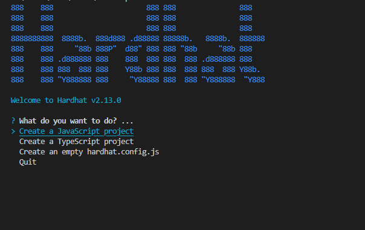
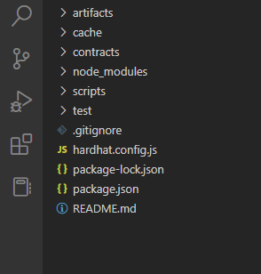
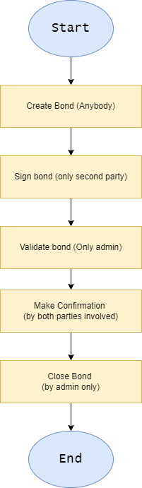
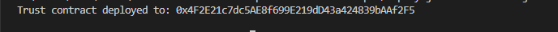
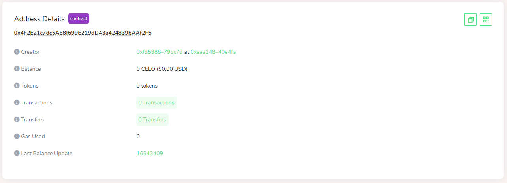

# Getting Started with Celo and Hardhat

- Celo: Celo is a platform acting as a global payment infrastructure for cryptocurrencies that aims to target mobile users. To this end, Celo's goal is for financial activity to be accessible to anyone globally thanks to its ability for payments to be sent to and from any phone number in the world. [Learn more](https://www.kraken.com/learn/what-is-celo) or visit [Celo documentation](https://docs.celo.org)
- Hardhat:  Hardhat is a development environment that helps developers in testing, compiling, deploying, and debugging dApps on the Ethereum blockchain. [Learn more](https://hardhat.org)
- We want to build a mini project to explain what celo and hardhat are.

# Prerequisite
- NodeJs
- NPM
- VSCode
- Solidity
- JavaScript
- Command line


# What you will take from this tutorial
- How to write solidity codes
- How to deploy solidity codes to celo blockchain
- How to use hardhat to compile and deploy your solidity code
- Usage of the command line

# Aims 
The aim of this tutorial is to teach you the following:
- How to write smart contract with solidity
- How to deploy the smart contrat using Hardhat
- Interacting with Celo Testnet

# Step 1: Installing hardhat
Since we will be using Hardhat for this tutorial, the first thing to do is to install harhdat into your computer. Follow the steps below to install hardhat into your computer system.

> **Note** Before you carry out the steps below, please ensure you have node and npm install on your system. If ytou don't have node install, go to [this link](https://www.guru99.com/download-install-node-js.html) to learn how to install it. npm mostly comes with node. So when you install node, you might have automatically installed npm.

- Open your terminal and navigate to the location you want to install hardhat. Alternatively, tou can create a new folder and cd into the folder.
- Confirm if you have node installed by running this command 
```bash
node -v
```
If you have node version 16 installed, you will get an output similar to the one below:
```bash
v16.15.0
```
- Also confirm if you have npm installed by run this command
```bash
npm -v
```
If npm is installed correctly, you have the output
```bash
8.5.5
```
- After confirming that node and npm are installed in your system, proceed to run this command to crate an hardhat boilerplate
```bash
npx hardhat 
```
When you press enter in your keyboard after the above command, you will see somehting like this


- Select _Create a JavaScript project_ 
- Click enter for all other options tha twill come next
- After completion, it will create a hardhat boilderplate for you in the current directory
- lastly, run this command to install the hardhat package after creating the boilerplate.
```bash
npm install --save-dev  hardhat@^2.13.0 @nomicfoundation/hardhat-toolbox@^2.0.0
```
The command will install the hardhat package and store it in the node modules folder for use in your project.

Your project directory should look like this after instaling Hardhat



# Step 2: Hardhat configuration

After installing hardhat, the next step is to configure it to the taste of the project we are working on. In our case, we want to achieve the following:
- Deploy our contract to the Celo blockchaon
- Create a file to store the Contract ABI
- Crete another file to store the contract address

First thing to do is configure the hardhat.config.js file. This file is resnposble for all we need to connect our hardhat to the Celo blockchain as well as other configs. Paste the code below into your hardhat.config.js file.

```javascript
require("@nomiclabs/hardhat-waffle");
require('dotenv').config({path: '.env'});


// Your private key
 const PRIVATE_KEY = process.env.PRIVATE_KEY

/**
 * @type import('hardhat/config').HardhatUserConfig
 */
 module.exports = {
  solidity: "0.8.0",
  networks: {
    alfajores: {
      url: "https://alfajores-forno.celo-testnet.org",
      accounts: [PRIVATE_KEY],
      chainId: 44787,
    },
  },
};
```
Inside this file, we first made some imports and then crete a variable and give the variable a name `PRIVATE_KEY`. This variable stores the private key of the wallet that will be used to dpeloy the contract to Celo. To get your private key, Open your wallet (Celo extension wallet), click on the three dots on the top-right angle, click on "show account details", then click on "Export private key", enter your password and it will bring out your private key for you. Copy the private key to clipboard and return to vscode.

The next lines inthe config file above creates an configuration object and export it our of the file for hardhat to have access to. The solidity version was first specified as 0.8.0. then the network followed. We are using celo alfajores testnet and that is the network url. Lastly, our private key was passed and chain id as well.

The next file will improve is the file located in the `scripts/deploy.js`. This file is where hardhat looks when it want to deploy our smart contract. It contains javascript script that deploysu our contract to the Celo and stores the contract address as well as the ABI. Open the file, delete evrything inside and paste the code into it:

```javascript
const hre = require("hardhat");

async function main() {
  const Trust = await hre.ethers.getContractFactory("Trust");
  const trust = await Trust.deploy();

  await trust.deployed();

  console.log("Trust contract deployed to:", trust.address);
  storeContractData(trust);
}

function storeContractData(contract) {
  const fs = require("fs");
  const contractsDir = __dirname + "/../contracts";

  if (!fs.existsSync(contractsDir)) {
    fs.mkdirSync(contractsDir);
  }

  fs.writeFileSync(
    contractsDir + "/Trust-address.json",
    JSON.stringify({ Trust: contract.address }, undefined, 2)
  );

  const TrustArtifact = artifacts.readArtifactSync("Trust");

  fs.writeFileSync(
    contractsDir + "/Trust.json",
    JSON.stringify(TrustArtifact, null, 2)
  );
}

// We recommend this pattern to be able to use async/await everywhere
// and properly handle errors.
main()
  .then(() => process.exit(0))
  .catch((error) => {
    console.error(error);
    process.exit(1);
  });
```
Let us explain the code little by little

First, we import hardhat and store it inside `hre`. we then go ahead to create a function and name which is `main`. Inside the main function, we deploy our contract, console.log the address of the contract, and call the `storeContractData` in order to store the data derive from the contract just deployed. 

Next is `storeContractData` function. Which takes in contract data, creates two files `Trust-address.json` and `Trust.json`. `Trust-address.json` stores the address of our trust smart contract. `Trust.json` stores the contract data, inside where you can find th eco=tract abi.

lastly, we invoke the function by calling it with bracket.

# Step 3: Smart contract
In this step of the tutorial, we want to write th esmart contract. It will be written using Solidity. 

Go to contracts/ folder and create a new File, then call the file Trust.sol. Open the file let start writng the smart contract.

Before we go deep into the contract, let me give oyu a hint of how the contract work. Trust is an escrow contract that crate trust between two party involved in a business transaction. It holds the funds that is to be transferred to to the second party inside the contract and release it only when aggreement is reached between the two party. It goes through a series of process ot come to an agreement between the parties. The process is as follows.

1. The seller comes to the platform to create an bond and adds the address of the buyer into the bond
2. The buyer now cones to sign the bond created by the seller just to give theier consent that they are involve in the deal
3. After the seller had created the bond and the buyer had signed the bund, the bond is forward to the admin to a valid.
4. After an admin has validated the bond, then the two parties make confirmation that they have receive money and goods repectively.
5. After both party have made confirmation and are satisfied, an admin closed the bond.

The picture below describe the whole process using a diagramatic representation.



After understand how the smart contract works, let us go ahead to write the samrt contract.

Inside the trust.sol file you created earlier, add this line into it.

```javascript
// SPDX-License-Identifier: MIT
pragma solidity ^0.8.0;
```
The above code lines is usually the firlt line of code that is expected to be in our smrat contract. Line one is our license specification line. It let's the blockchain know that our file has a license, and in our code, we are using the MIT license. The second line is the solidity programming language compiler version. Solity has different compiler, that is why we have to state which one shouold compile our code. In our situation, the compiler that will compile our code is the `0.8.0` compiler and above. Anything below this will through an error and will not compile our code.

We will next create our contract body.

```javascript
contract Trust {}
```
The line we added to the file above creates a Contract body for us. We are using the keywork `contract` to let the compiler know that this is a contract. Follow by the keyword is the contract name. Ww want to name our contract Trust. Inside the braces is where we will write all the codes for thus contract.

Inside our contract the first things to do is to create a struct. 

```javascript
    struct Bond {
        uint256 id; 
        string name; 
        uint256 amount; 
        address creator; 
        address[2] parties; 
        address[2] confirmations;
        bool signed; 
        bool validated; 
        bool completed; 
    }
```
We create a struct and name it Bond. Struct is a complex data type in solidity that let you create a single variable that can holds many data type at the same time. Let me break down what the variables of th struct do.

- id - unique identifier of the bond
- name - string to describe what the bond is all abot
- amount - amount the other party is expected to pay. the platform get's 10% as fee
- creator - the address that create the bond
- parties - addreses of creator and second party involved
- confirmations - evidence of both parties confirming the deal is completed
- signed - if a deal is sign or not
- validated - if a deal is valited by an admin
- completed - if a deal is completed and both parties are satisfied

so that is is for the struct in our contract. next is to create the variables keep track of some data inside the contract.

```javascript
 uint256 ids; 
    address payable immutable admin;
    uint256 adminFees;
    mapping(uint256 => Bond) bonds; 
```

ids will assign IDs to the bonds users will create in our contract. admin will be the one responsible for validating and closing bonds between party involved. adminfees is a constant that determines how much the platform will change for their service. bonds is a mapping storing all bonds anyone creates an dthen mapping an unsigned interger to that bond for accessibliity.

We will not create an event and constructor for our contract.

```javascript
    event CreateBond(
        uint256 id,
        string name,
        address indexed party1,
        address indexed party2
    );

    constructor() {
        admin = payable(msg.sender);
    }
```
The event we created (CreateBond) will be emitted when we create a new bond. if you notice, you will ovserve we used keyword indexed for party one and party 2. This is because we want them to be querried easily by their name from the transaction logs.

The constructor sets the admin variable as the address of the person that deployed the contract.

**Contract Functions**

The first function we will create inside our contract is the `createBond` function.

```javascript
    function createBond(
        string calldata _name,
        uint256 _expectedAmount,
        address _secondParty
    ) public {
        address[2] memory parties = [msg.sender, _secondParty];
        address[2] memory confirmations = [address(0), address(0)];
        uint256 amount = _expectedAmount * 1 ether; // amount is converted to ether
        bonds[ids] = Bond(
            ids,
            _name,
            amount,
            msg.sender,
            parties,
            confirmations,
            false,
            false,
            false
        );
        emit CreateBond(ids, _name, msg.sender, _secondParty);
        ids++;
    }
```
The function is responsivle for create bonds between the parties involved in the deal. If you noticed, the function argument uses calldata to store the strings it is accepting. calldata is a memory allocation that is similar to memory, but the difference is that calldata is constant an can only be used in function arguments. Anyone can call this function to create a bond.

The second function is the `signBond` function.

```javascript
    function signBond(uint256 _bondId) public {
        Bond storage bond = bonds[_bondId];
        require(
            msg.sender == bond.parties[1],
            "Only second party can sign bond"
        );
        bond.signed = true;
    }
```
The sign bond function takes as argument the bond id, get the bond object frm storage, do some validation to ensure the right persion is the one sjgning the bond, and then proceed to sign the bond. Only the second party involved in a bond can call this function.

The next function is the `validateBond`

```javascript
    function validateBond(uint256 _bondId) public {
        Bond storage bond = bonds[_bondId];
        require(msg.sender == admin, "Only admin can validate bond");
        require(
            bond.signed == true,
            "Bond has not been signed by second party before it can be validated"
        );
        bond.validated = true;
    }
```
The function validated a bond that has been created and signed by the second parties involved. It accepts the bond id as argument and use it to get the bond from storage. It also do some checks to make sure it is the admin calling the function and the bond is already sign. It then continue to the next line which validatd the bond.

The next function is `makeConfirmation`

```javascript
 // User confirms they have completed their part of deal
    function makeConfirmation(uint256 _bondId) public payable {
        Bond storage bond = bonds[_bondId];
        require(bond.signed == true, "Bond not signed yet");
        require(bond.validated = true, "Bond not validated yet");
        address creator = bond.parties[0];
        address secondParty = bond.parties[1];
        require(
            (msg.sender == creator) || (msg.sender == secondParty),
            "Only the two parties involved can make confirmations"
        );
        // First space of confirmation is reserved for bond creator
        // Second space of confirmation is reserved for second party
        if (msg.sender == creator) {
            // confirm that bond creator has send goods and receive funds
            bond.confirmations[0] = msg.sender;
        } else if (msg.sender == secondParty) {
            // confirm that goods is received and funds sent
            require(msg.value == bond.amount, "Please send the correct amount");
            bond.confirmations[1] = msg.sender;
        }
    }
```
This is th function that the parties involved call to notify the smart contract that they have complete ther respective part of the deal. For this function to be called on a bond, the bond must have to be signed and valiated by the admin. Only the two parties involved in the bond can call this function on that bond. When the second party (buyer) call this function, they are expectd to pay the amount specified in the bond, else it will not go through.

The next function is `closeBond`

```javascript
    // Platform confirms agreement has been esterblished between two parties and close bond
    // Only admin can close bond
    // Both parties has to first confirm bond is completed before bond can be closed
    function closeBond(uint256 _bondId) public {
        Bond storage bond = bonds[_bondId];
        require(payable(msg.sender) == admin, "Only admin can close bond");
        require(bond.validated == true, "Bond has not been validated yet");
        require(
            bond.confirmations[0] != address(0),
            "First party has not confirmed transaction"
        );
        require(
            bond.confirmations[1] != address(0),
            "Second party has not confirmed transaction"
        );

        // First transfer funds to first party
        // 10% of funds is deducted for platform fee
        address payable firstParty = payable(bond.parties[0]);
        uint256 fund = (bond.amount * 90) / 100;
        adminFees += (bond.amount * 10) / 100; // reserve 10% for platform fee
        (bool success, ) = firstParty.call{value: fund}("");
        require(success, "Failed to send funds to second party");
        bond.completed = true;
    }
```
This is the function the platform uses to confirm the an agreement has been reached between the two party involved and then close the bond. Only the admin can call this function, the bond must have been validated, it must have been signed by both party involved. After all checks have been done, the function withdraws it's own percent and send the rest to the first party (seller). It then completes the bond and closes it.

```javascript
    // Get total fees sgored in the contract
    function getContractBalance() public view returns (uint256) {
        require(msg.sender == admin, "Only admin can check balance");
        uint256 bal = address(this).balance;
        return bal;
    }

    // Get total fees reserved for platform
    function getTotalAdminFees() public view returns (uint256) {
        require(msg.sender == admin, "Only admin can check fees");
        return adminFees;
    }

    // Withdraw accumulated fees in contract
    function withdrawAccumulatedFees() public returns (bool) {
        require(
            msg.sender == admin,
            "Only admin can withdraw accumulated fees"
        );
        uint256 bal = adminFees;
        (bool success, ) = payable(msg.sender).call{value: bal}("");
        adminFees = 0; // reset value after withdrawal
        return success;
    }

    // View details about a bond
    function viewBond(uint256 _bondId)
        public
        view
        returns (
            string memory name,
            uint256 amount,
            address creator,
            bool signed,
            bool validated,
            bool completed
        )
    {
        Bond memory bond = bonds[_bondId];
        name = bond.name;
        amount = bond.amount;
        creator = bond.creator;
        signed = bond.signed;
        validated = bond.validated;
        completed = bond.completed;
    }
}
```
The next couple of functions defined in the smart contract are pretty straitforwared. 

- `getContractBalance` - Fetches the the total amount of funds stored in the contract. Only admin can call this function
- `getTotalAdminFees` - This function gett the total amount of fees accumulated by the platform from the 10% it grt's from every bond completed. Only admin can call this function
- `withdrawAccumulatedFees` - This function simply let's the admin to withdraw the fees accumulated in the platfrom.
- `viewBond` - This function returns the details of a partifular bond.

That is the end of our functions and the end of our contract as well.

In the next stop we will deploy the contract to celo using hardhat and all the setup we creaed earlier.

# Step 4: Deployment
IN this step, we will deploy the smart contract.

First thing to do is to installed the packages we missed earlier. Ruhn the command below to install the packages

```bash
npm install @nomiclabs/hardhat-waffle dotenv
```
We just installed the hardhat-waffle package and dotenv package which will help us to deployment of the smart contract.

Before deploying the smart contract, one last thign to do is to create a `.env` file in the root directory and add your private key inside the file.

```bash
PRIVATE_KEY="enterprivatekeyhere"
```
Save the file and add it yo your gitignore file so that you don't push it to Github. 

_Please note that your private key should be kept secret to you alone and not shared with anyone. If someone has your private key, then they can use it to stel the funds in your wallet_

Now that everything is set, you this command to deploy your contract

```bash
npx hardhat run scripts/deploy.js --network alfajores
```
After running the command above, The output in your command line should look similar to this.

.

The contract has deployed to celo testnet (alfajores). You can also see the deployment live on Celo testnet by pasting the contract address in celo alfajores explorer.



# What to do from here?
Now that you have completely built a full-fledge smart contract that can solve a complex problem, you can do any or all of the following to improve this new skills set you just added yo your knowledge box.

- Write testcases for the smart contract
- Build a frontend that connect the contract to the blockchain
- Add more functionalities that will improve on the one we added

# About me
My name is Adamu Peter, a web developer who recently developed passion fo rblockchain technology and I have since been building project and improving the knowledge in the space.